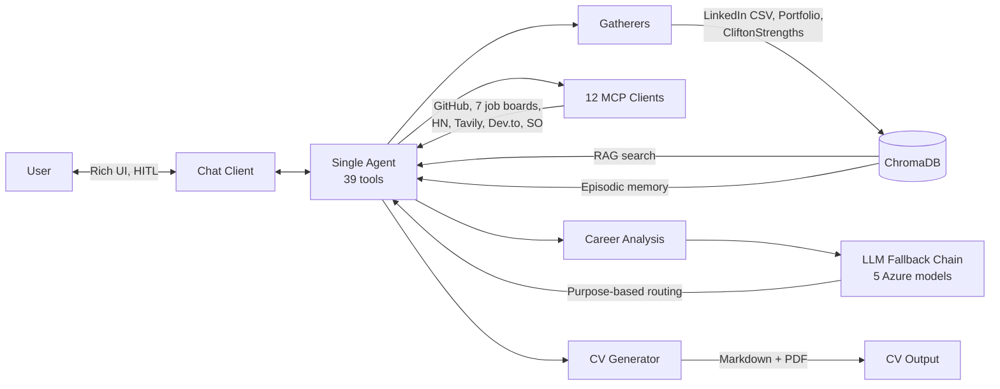

# FutureProof

[](https://github.com/juanmanueldaza/futureproof/actions/workflows/ci.yml)
[](https://www.python.org/downloads/)
[](https://www.gnu.org/licenses/old-licenses/gpl-2.0.en.html)

Career intelligence agent — 39 tools, 12 MCP clients, 13.3k lines of Python across 85 files. Gathers career data from 5 sources, searches 7+ job boards, and generates ATS-optimized CVs through conversational chat. Built with LangChain, LangGraph, and ChromaDB.

## Architecture at a Glance



- **Single agent** with `create_agent()` + 39 tools — no multi-agent routing
- **Database-first pipeline** — gatherers index directly to ChromaDB, no intermediate files
- **Purpose-based LLM routing** — different models for tool calling, analysis, summarization, and synthesis
- **Two-pass synthesis** — `AnalysisSynthesisMiddleware` replaces generic agent responses with focused, data-driven synthesis from a reasoning model
- **Custom `ToolCallRepairMiddleware`** — fixes orphaned parallel tool results after HITL resume
- **5-model fallback chain** with automatic rate-limit recovery and reasoning model support (o-series)

## Architecture Decisions

### Multi-agent → Single agent

GPT-4.1 over-delegated across agents, approximated with wrong tools, and didn't continue after handoff returns. Collapsed to a single agent with all 39 tools. Result: reliable tool selection, simpler state management, no routing logic.

### File-based → Database-first pipeline

The markdown chunker merged small entries (2-20 tokens each) into oversized chunks, making individual items unsearchable. Eliminated the entire file I/O layer and the markdown header roundtrip — gatherers now return `Section` NamedTuples and index directly to ChromaDB via `index_sections()`. No intermediate files, no header regex parsing.

### Systematic deletion

Removed ~2,800 lines across multiple commits — the daemon module, 5 non-Azure LLM providers, the multi-agent handoff system, file-based data loading, and pass-through service wrappers. Each removal motivated by SOLID/DRY/YAGNI principles.

## Key Engineering

| What | Where | Why it matters |
|------|-------|----------------|
| `AnalysisSynthesisMiddleware` | [`agents/middleware.py`](src/futureproof/agents/middleware.py) | Two-pass: masks analysis results so the agent can't rewrite them, then replaces the generic final response with a focused synthesis from a reasoning model (o4-mini) |
| `ToolCallRepairMiddleware` | [`agents/middleware.py`](src/futureproof/agents/middleware.py) | Detects orphaned `tool_calls` after HITL resume and injects synthetic ToolMessages — fixes a LangChain Send API edge case |
| `FallbackLLMManager` | [`llm/fallback.py`](src/futureproof/llm/fallback.py) | 5-model chain with rate-limit detection, automatic failover, and purpose-based routing (`agent`/`analysis`/`summary`/`synthesis`) |
| LinkedIn CSV parser | [`gatherers/linkedin.py`](src/futureproof/gatherers/linkedin.py) | Parses 17 CSV files directly from LinkedIn ZIP — no external dependencies, 3-tier priority system |
| MCP client registry | [`mcp/factory.py`](src/futureproof/mcp/factory.py) | OCP-compliant factory with availability checkers — add a new job board by adding one dict entry |
| Security layers | [`utils/security.py`](src/futureproof/utils/security.py) | 13 prompt injection patterns, PII anonymization, SSRF protection, command injection prevention |
| `SummarizationMiddleware` tuning | [`agents/career_agent.py`](src/futureproof/agents/career_agent.py) | Trigger at 32k tokens (not 8k default) — aggressive summarization causes models to lose multi-step instructions |

## What It Does

- **Data gathering** — `"Gather all my career data"` — LinkedIn, GitHub, GitLab, portfolio, CliftonStrengths
- **Knowledge base** — `"Search my knowledge base for Python projects"` — RAG search over ChromaDB
- **Career analysis** — `"Analyze my skill gaps for Staff Engineer"` — skill gaps, alignment, market fit
- **Market intelligence** — `"Search for remote Python developer jobs"` — 7+ job boards, HN trends, salary data
- **CV generation** — `"Generate my CV in ATS format"` — English/Spanish, ATS/creative, Markdown + PDF
- **Episodic memory** — `"What job applications have I tracked?"` — decisions, applications across sessions

## Quick Start

```bash
git clone https://github.com/juanmanueldaza/futureproof.git
cd futureproof
python -m venv .venv
source .venv/bin/activate
pip install -r requirements.txt
pip install -e .
cp .env.example .env
```

Minimum configuration (edit `.env`):

```bash
AZURE_OPENAI_API_KEY=your-key
AZURE_OPENAI_ENDPOINT=https://your-resource.openai.azure.com/
AZURE_CHAT_DEPLOYMENT=gpt-4.1
AZURE_EMBEDDING_DEPLOYMENT=text-embedding-3-small
```

Then start chatting:

```bash
futureproof chat                    # Interactive session
futureproof ask "Analyze my gaps"   # One-off question
futureproof memory --threads        # List conversation threads
```

## Project Structure

```
src/futureproof/
├── cli.py                  # Typer CLI (chat, ask, memory)
├── config.py               # Pydantic settings from env vars
├── agents/
│   ├── career_agent.py     # Single agent with create_agent()
│   ├── middleware.py        # Dynamic prompt, AnalysisSynthesisMiddleware, ToolCallRepairMiddleware
│   ├── orchestrator.py     # LangGraph Functional API for analysis
│   ├── state.py            # TypedDict state definitions
│   ├── helpers/            # Orchestrator support
│   └── tools/              # 39 tools by domain
├── chat/                   # Streaming client with HITL, Rich UI
├── gatherers/
│   ├── linkedin.py         # LinkedIn ZIP → CSV parser
│   ├── cliftonstrengths.py # CliftonStrengths PDF parser
│   ├── portfolio/          # Website scraper (SSRF-protected)
│   └── market/             # Job market, tech trends
├── generators/             # CV generation (Markdown + PDF)
├── llm/                    # FallbackLLMManager, purpose-based routing
├── memory/                 # ChromaDB knowledge + episodic memory
├── mcp/                    # 12 MCP clients (GitHub, job boards, HN, etc.)
├── prompts/                # LLM prompt templates
├── services/               # Business logic layer
└── utils/                  # Security, data loading, logging
```

## Development

```bash
pip install -r requirements-dev.txt

pytest tests/ -q              # 138 tests in ~1s
pyright src/futureproof       # Type checking
ruff check .                  # Lint
```

## Tech Stack

**Python 3.13+** · [LangChain](https://python.langchain.com/) + [LangGraph](https://langchain-ai.github.io/langgraph/) · [ChromaDB](https://www.trychroma.com/) · [Azure OpenAI](https://azure.microsoft.com/en-us/products/ai-services/openai-service) · [Typer](https://typer.tiangolo.com/) + [Rich](https://rich.readthedocs.io/) · [WeasyPrint](https://weasyprint.org/) · [httpx](https://www.python-httpx.org/)

---

Contributions welcome — see [CONTRIBUTING.md](CONTRIBUTING.md). Licensed under [GPL-2.0](LICENSE).
