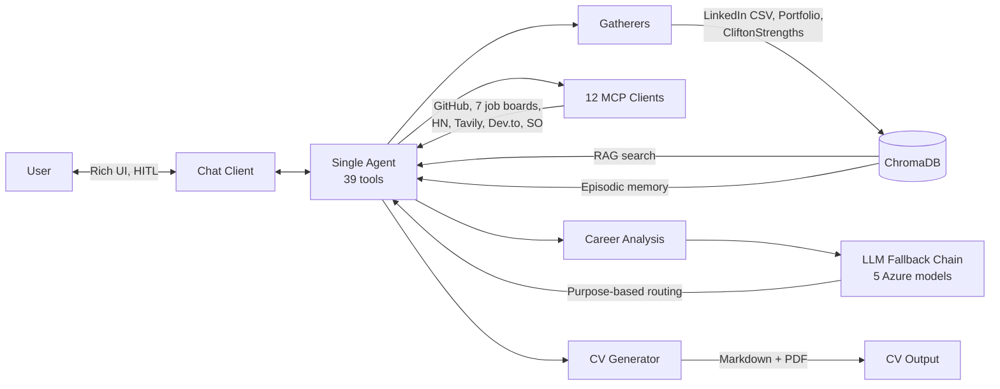

# FutureProof

[](https://www.python.org/downloads/)
[](https://www.gnu.org/licenses/old-licenses/gpl-2.0.en.html)

Career intelligence agent that gathers professional data, searches job boards, analyzes career trajectories, and generates ATS-optimized CVs — all through conversational chat. Built with LangChain, LangGraph, and ChromaDB on Azure OpenAI.

## What It Does

```
You:   Gather all my career data
Agent: [gathers LinkedIn, portfolio, CliftonStrengths → indexes to ChromaDB]

You:   Analyze my skill gaps for Staff Engineer
Agent: [runs skill gap analysis using your data + market trends]

You:   Search for remote Python developer jobs in Europe
Agent: [queries 7 job boards + Hacker News hiring threads]

You:   Generate my CV targeting that Staff Engineer role
Agent: [generates ATS-optimized CV in Markdown + PDF]
```

One agent, 39 tools, 12 MCP clients. Data sources: LinkedIn CSV export, GitHub (live MCP), GitLab (glab CLI), portfolio websites, CliftonStrengths PDF, 7 job boards, Hacker News, Dev.to, Stack Overflow, Tavily search.

## Architecture



**Key design decisions:**

- **Single agent** — multi-agent handoffs failed with GPT-4.1 (over-delegation, lost context). One agent with all tools is simpler and more reliable.
- **Database-first pipeline** — gatherers return `Section` NamedTuples and index directly to ChromaDB. No intermediate files, no markdown header roundtrip.
- **Two-pass synthesis** — GPT-4o genericizes analysis responses regardless of prompt engineering. `AnalysisSynthesisMiddleware` lets the agent do tool calling, then replaces its generic response with focused synthesis from a reasoning model.
- **5-model fallback chain** — GPT-4.1 → GPT-5 Mini → GPT-4o → GPT-4.1 Mini → GPT-4o Mini, with automatic rate-limit recovery and purpose-based routing (agent/analysis/summary/synthesis).
- **HITL confirmation** — destructive or expensive operations (CV generation, full data gathering, knowledge clearing) require user approval via LangGraph's `interrupt()`.

## Quick Start

```bash
git clone https://github.com/juanmanueldaza/futureproof.git
cd futureproof
python -m venv .venv && source .venv/bin/activate
pip install -r requirements.txt && pip install -e .
cp .env.example .env
```

Edit `.env` with your Azure OpenAI credentials:

```bash
AZURE_OPENAI_API_KEY=your-key
AZURE_OPENAI_ENDPOINT=https://your-resource.openai.azure.com/
AZURE_CHAT_DEPLOYMENT=gpt-4.1
AZURE_EMBEDDING_DEPLOYMENT=text-embedding-3-small
```

```bash
futureproof chat                    # Interactive session
futureproof ask "Analyze my gaps"   # One-off question
futureproof memory --threads        # List conversation threads
```

## Project Structure

```
src/futureproof/
├── agents/
│   ├── career_agent.py     # Single agent: create_agent(), 4 middlewares, singleton cache
│   ├── middleware.py        # Dynamic prompt, synthesis, tool repair, summarization
│   ├── orchestrator.py      # LangGraph Functional API for analysis workflows
│   ├── helpers/             # Orchestrator support (data pipeline, LLM invoker)
│   └── tools/              # 39 tools by domain (profile, gathering, analysis, market, etc.)
├── chat/                   # Streaming client, HITL interrupt loop, Rich UI
├── gatherers/              # LinkedIn CSV, CliftonStrengths PDF, portfolio scraper, market data
├── generators/             # CV generation (Markdown + PDF via WeasyPrint)
├── llm/                    # FallbackLLMManager: 5-model chain, purpose-based routing
├── memory/                 # ChromaDB (knowledge RAG + episodic), chunker, profile, embeddings
├── mcp/                    # 12 MCP clients: GitHub, Tavily, 6 job boards, HN, financial, content
├── prompts/                # System + analysis + CV prompt templates
├── services/               # GathererService, AnalysisService, KnowledgeService
└── utils/                  # PII anonymization, data loading, logging
```

## Development

```bash
pip install -r requirements-dev.txt

pytest tests/ -q              # Unit tests
pytest tests/eval/ -m eval    # Eval tests (need Azure credentials)
pyright src/futureproof       # Type checking
ruff check .                  # Lint
```

## Tech Stack

**Python 3.13** · [LangChain](https://python.langchain.com/) + [LangGraph](https://langchain-ai.github.io/langgraph/) · [ChromaDB](https://www.trychroma.com/) · [Azure OpenAI](https://azure.microsoft.com/en-us/products/ai-services/openai-service) · [Typer](https://typer.tiangolo.com/) + [Rich](https://rich.readthedocs.io/) · [WeasyPrint](https://weasyprint.org/) · [httpx](https://www.python-httpx.org/)

---

Licensed under [GPL-2.0](LICENSE).
