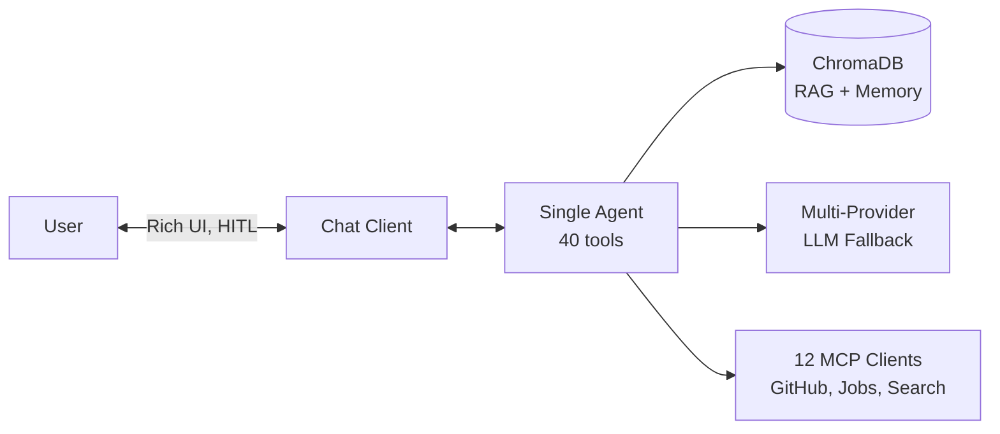
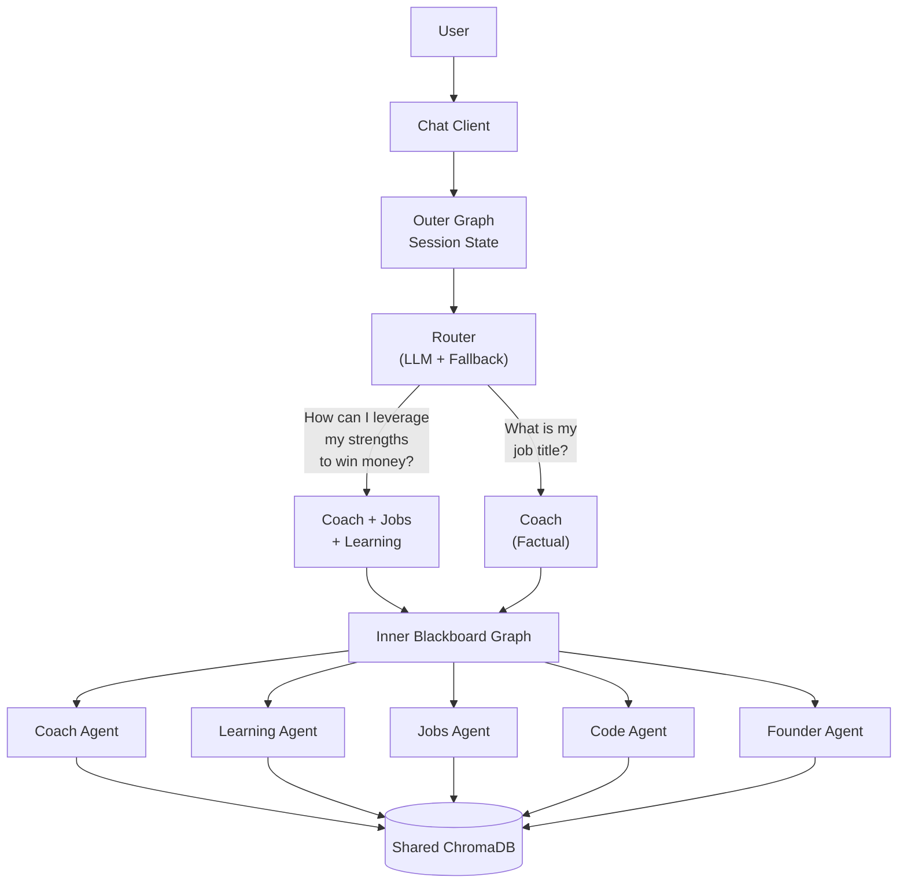

# FutureProof

[](https://www.python.org/downloads/)
[](LICENSE)
[](tests/)

Career intelligence agent that gathers professional data, searches job boards, analyzes career trajectories, and generates ATS-optimized CVs through conversational chat.

## Quick Start

```bash
# Install
pipx install fu7ur3pr00f

# Run
fu7ur3pr00f
```

In the chat:
- `/setup` — Configure your LLM provider
- `/gather` — Import LinkedIn, GitHub, portfolio, CliftonStrengths
- `/analyze` — Get skill gap analysis
- `/search` — Query 7 job boards + Hacker News
- `/generate` — Create ATS-optimized CV (Markdown + PDF)

## Installation

### Debian/Ubuntu (amd64)

```bash
curl -fsSL https://juanmanueldaza.github.io/fu7ur3pr00f/fu7ur3pr00f-archive-keyring.gpg | \
  sudo tee /usr/share/keyrings/fu7ur3pr00f-archive-keyring.gpg >/dev/null

echo "deb [arch=amd64 signed-by=/usr/share/keyrings/fu7ur3pr00f-archive-keyring.gpg] \
https://juanmanueldaza.github.io/fu7ur3pr00f stable main" | \
  sudo tee /etc/apt/sources.list.d/fu7ur3pr00f.list

sudo apt update && sudo apt install fu7ur3pr00f
```

### Development

```bash
git clone https://github.com/juanmanueldaza/fu7ur3pr00f.git
cd fu7ur3pr00f
pip install -e .
```

## Configuration

Run `/setup` in the chat, or manually edit `~/.fu7ur3pr00f/.env`:

```bash
# Pick ONE provider (auto-detected if empty)
FUTUREPROOF_PROXY_KEY=fp-...   # Default, zero config
OPENAI_API_KEY=sk-...
ANTHROPIC_API_KEY=sk-ant-...
GOOGLE_API_KEY=...
OLLAMA_BASE_URL=http://localhost:11434  # Local, offline
```

See [.env.example](.env.example) for all options.

## Architecture

### Single-Agent (Current)


```mermaid
graph LR
    User <-->|Rich UI, HITL| Chat[Chat Client]
    Chat <--> Agent[Single Agent<br/>40 tools]
    Agent --> ChromaDB[(ChromaDB<br/>RAG + Memory)]
    Agent --> LLM[Multi-Provider<br/>LLM Fallback]
    Agent --> MCP[12 MCP Clients<br/>GitHub, Jobs, Search]
```

### Multi-Agent (LLM-Routed)


```mermaid
graph TB
    User --> Chat[Chat Client]
    Chat --> Engine[Outer Graph<br/>Session State]
    Engine --> Router["Router<br/>(LLM + Fallback)"]
    Router -->|"How can I leverage<br/>my strengths<br/>to win money?"| Multi["Coach + Jobs<br/>+ Learning"]
    Router -->|"What is my<br/>job title?"| Single["Coach<br/>(Factual)"]
    Multi & Single --> Blackboard[Inner Blackboard Graph]
    Blackboard --> Coach[Coach Agent]
    Blackboard --> Learning[Learning Agent]
    Blackboard --> Jobs[Jobs Agent]
    Blackboard --> Code[Code Agent]
    Blackboard --> Founder[Founder Agent]
    Coach & Learning & Jobs & Code & Founder --> ChromaDB[(Shared ChromaDB)]
```

**Routing Architecture:**

- **LLM-based semantic routing**: Understands query intent, selects 1-4 specialists
- **Keyword fallback**: Automatic fallback if LLM unavailable (rate limits, network errors)
- **Fast paths**: Factual queries → coach only; follow-ups → reuse previous specialists
- **Structured output**: `RoutingDecision` model guarantees valid specialist names
- **Specialist guidance**: All instructions load from `prompts/md/specialist_guidance.md` (no fallbacks)

**Design decisions:**

| Decision | Why |
|----------|-----|
| Single agent | Multi-agent handoffs failed with GPT-4.1 (over-delegation, lost context) |
| LLM routing | Keyword matching too brittle — "leverage strengths to win money" should route to 3 specialists, not 1 |
| Keyword fallback | Network-resilient: continues working if LLM unavailable |
| Blackboard pattern | Multi-specialist analysis with shared context and iteration |
| Database-first | Gatherers index directly to ChromaDB — no intermediate files |
| Two-pass synthesis | `AnalysisSynthesisMiddleware` replaces generic LLM output with focused reasoning |
| HITL confirmation | Destructive/expensive operations require user approval via `interrupt()` |
| Prompt-driven | All specialist behavior from prompts folder, zero hardcoded fallbacks |

## Development

```bash
# Install dev tools
pip install pyright pytest ruff

# Test
pytest tests/ -q
pyright src/fu7ur3pr00f
ruff check .
ruff check . --fix
```

### Scripts

| Script | Purpose |
|--------|---------|
| `setup.sh` | One-time Azure/config setup |
| `fresh_install_check.sh` | Validate pipx install |
| `clean_dev_artifacts.sh` | Clean build artifacts |
| `build_deb.sh` | Build .deb package |
| `build_apt_repo.sh` | Build apt repository |
| `validate_apt_artifact.sh` | Test .deb in Docker |
| `vagrant.sh` | Vagrant VM management |

See [docs/scripts.md](docs/scripts.md) for detailed usage.

### Testing

```bash
# Unit tests
pytest tests/ -q

# Benchmarks
pytest tests/benchmarks/ -v

# Fresh install check
scripts/fresh_install_check.sh --source local --config-from .env

# Vagrant apt repo testing
scripts/vagrant.sh test-apt

# Multi-agent system testing
scripts/vagrant.sh multi
```

See [docs/development.md](docs/development.md) for details.

## System Dependencies (Optional)

| Feature | Package |
|---------|---------|
| GitLab | `sudo apt install glab` |
| CliftonStrengths PDF | `sudo apt install poppler-utils` |
| CV PDF export | `sudo apt install libpango-1.0-0 libpangoft2-1.0-0 libcairo2 libfontconfig1 libgdk-pixbuf-2.0-0` |

## Tech Stack

Python 3.13 · LangChain + LangGraph · ChromaDB · Typer + Rich · WeasyPrint · MCP

## Documentation

### Getting Started
- [Quick Start](#quick-start) — Install and run
- [Configuration](docs/configuration.md) — LLM providers, settings
- [Chat Commands](docs/chat_commands.md) — All commands reference

### User Guides
- [Data Gathering](docs/gatherers.md) — Import LinkedIn, GitHub, CV
- [CV Generation](docs/cv_generation.md) — Generate ATS-optimized CVs
- [Troubleshooting](docs/troubleshooting.md) — Common issues

### Reference
- [Architecture](docs/architecture.md) — System design
- [Tools](docs/tools.md) — All 40 tools
- [MCP Clients](docs/mcp_clients.md) — All 12 MCP clients
- [Memory System](docs/memory_system.md) — ChromaDB, RAG
- [Prompts](docs/prompts.md) — Prompt templates
- [Scripts](docs/scripts.md) — Build and test scripts

### Contributing
- [Contributing](CONTRIBUTING.md) — How to contribute
- [Code of Conduct](CODE_OF_CONDUCT.md)
- [Security](SECURITY.md)

---

Licensed under [GPL-2.0](LICENSE).
