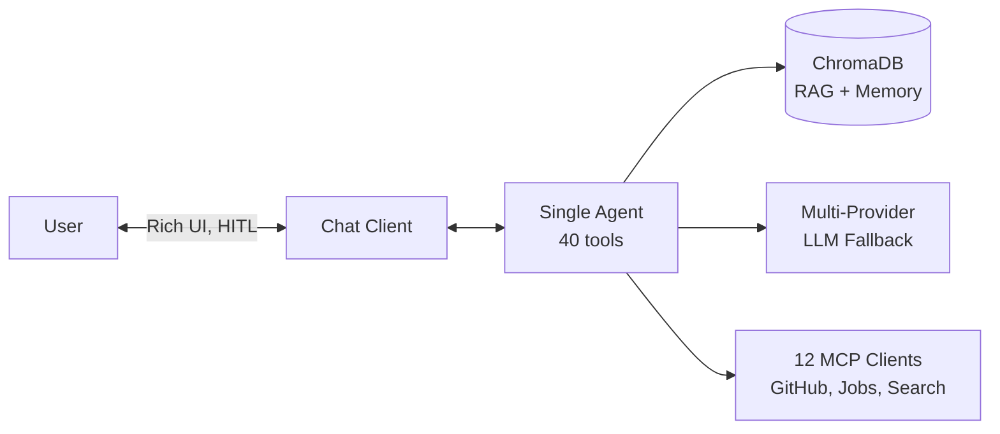

# FutureProof

[](https://www.python.org/downloads/)
[](LICENSE)
[](tests/)

Career intelligence agent that gathers professional data, searches job boards, analyzes career trajectories, and generates ATS-optimized CVs through conversational chat.

## Quick Start

```bash
# Install
pipx install fu7ur3pr00f

# Run
fu7ur3pr00f
```

In the chat:
- `/setup` — Configure your LLM provider
- `/gather` — Import LinkedIn, GitHub, portfolio, CliftonStrengths
- `/analyze` — Get skill gap analysis
- `/search` — Query 7 job boards + Hacker News
- `/generate` — Create ATS-optimized CV (Markdown + PDF)

## Installation

### Debian/Ubuntu (amd64)

```bash
curl -fsSL https://juanmanueldaza.github.io/fu7ur3pr00f/fu7ur3pr00f-archive-keyring.gpg | \
  sudo tee /usr/share/keyrings/fu7ur3pr00f-archive-keyring.gpg >/dev/null

echo "deb [arch=amd64 signed-by=/usr/share/keyrings/fu7ur3pr00f-archive-keyring.gpg] \
https://juanmanueldaza.github.io/fu7ur3pr00f stable main" | \
  sudo tee /etc/apt/sources.list.d/fu7ur3pr00f.list

sudo apt update && sudo apt install fu7ur3pr00f
```

### Development

```bash
git clone https://github.com/juanmanueldaza/fu7ur3pr00f.git
cd fu7ur3pr00f
pip install -e .
```

## Configuration

Run `/setup` in the chat, or manually edit `~/.fu7ur3pr00f/.env`:

```bash
# Pick ONE provider (auto-detected if empty)
FUTUREPROOF_PROXY_KEY=fp-...   # Default, zero config
OPENAI_API_KEY=sk-...
ANTHROPIC_API_KEY=sk-ant-...
GOOGLE_API_KEY=...
OLLAMA_BASE_URL=http://localhost:11434  # Local, offline
```

See [.env.example](.env.example) for all options.

## Architecture


```mermaid
graph LR
    User <-->|Rich UI, HITL| Chat[Chat Client]
    Chat <--> Agent[Single Agent<br/>40 tools]
    Agent --> ChromaDB[(ChromaDB<br/>RAG + Memory)]
    Agent --> LLM[Multi-Provider<br/>LLM Fallback]
    Agent --> MCP[12 MCP Clients<br/>GitHub, Jobs, Search]
```

**Design decisions:**

| Decision | Why |
|----------|-----|
| Single agent | Multi-agent handoffs failed with GPT-4.1 (over-delegation, lost context) |
| Database-first | Gatherers index directly to ChromaDB — no intermediate files |
| Two-pass synthesis | `AnalysisSynthesisMiddleware` replaces generic LLM output with focused reasoning |
| HITL confirmation | Destructive/expensive operations require user approval via `interrupt()` |

## Development

```bash
# Install dev tools
pip install pyright pytest ruff

# Test
pytest tests/ -q
pyright src/fu7ur3pr00f
ruff check .
ruff check . --fix

# Fresh install check (pipx + MCP/LLM)
scripts/fresh_install_check.sh --source local --config-from .env

# Vagrant apt testing (isolated VM)
scripts/run_vagrant_apt_smoke.sh ubuntu2404
scripts/run_vagrant_apt_smoke.sh debian12
```

See [docs/development.md](docs/development.md) for details.

## System Dependencies (Optional)

| Feature | Package |
|---------|---------|
| GitLab | `sudo apt install glab` |
| CliftonStrengths PDF | `sudo apt install poppler-utils` |
| CV PDF export | `sudo apt install libpango-1.0-0 libpangoft2-1.0-0 libcairo2 libfontconfig1 libgdk-pixbuf-2.0-0` |

## Tech Stack

Python 3.13 · LangChain + LangGraph · ChromaDB · Typer + Rich · WeasyPrint · MCP

## Documentation

- [Contributing](CONTRIBUTING.md)
- [Code of Conduct](CODE_OF_CONDUCT.md)
- [Security](SECURITY.md)
- [Architecture](docs/architecture.md)
- [Configuration](docs/configuration.md)
- [Development](docs/development.md)
- [Scripts](docs/scripts.md)
- [Tools](docs/tools.md) — All 40 tools

---

Licensed under [GPL-2.0](LICENSE).
