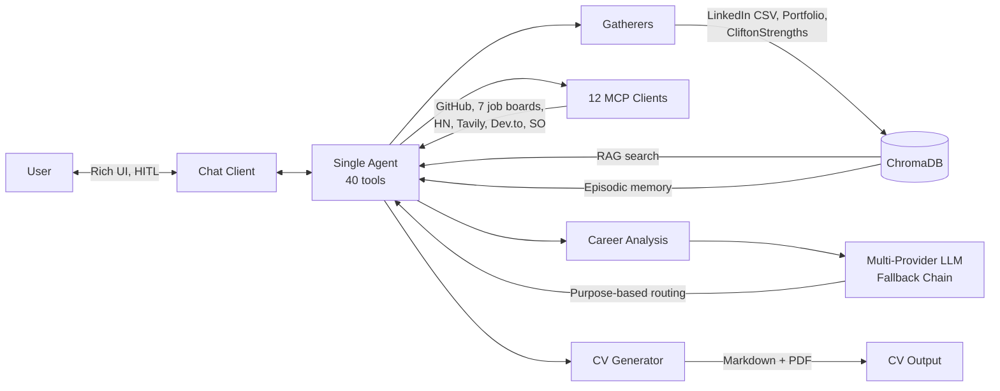

# FutureProof

[](https://www.python.org/downloads/)
[](https://www.gnu.org/licenses/old-licenses/gpl-2.0.en.html)

Career intelligence agent that gathers professional data, searches job boards, analyzes career trajectories, and generates ATS-optimized CVs — all through conversational chat. Built with LangChain, LangGraph, and ChromaDB. Supports OpenAI, Anthropic, Google, Azure, and Ollama.

## What It Does

```
You:   Gather all my career data
Agent: [gathers LinkedIn, portfolio, CliftonStrengths → indexes to ChromaDB]

You:   Analyze my skill gaps for Staff Engineer
Agent: [runs skill gap analysis using your data + market trends]

You:   Search for remote Python developer jobs in Europe
Agent: [queries 7 job boards + Hacker News hiring threads]

You:   Generate my CV targeting that Staff Engineer role
Agent: [generates ATS-optimized CV in Markdown + PDF]
```

One agent, 40 tools, 12 MCP clients. Data sources: LinkedIn CSV export, GitHub (live MCP), GitLab (glab CLI), portfolio websites, CliftonStrengths PDF, 7 job boards, Hacker News, Dev.to, Stack Overflow, Tavily search.

## Architecture


```mermaid
graph LR
    User <-->|Rich UI, HITL| Chat[Chat Client]
    Chat <--> Agent[Single Agent<br/>40 tools]

    Agent --> Gather[Gatherers]
    Agent --> MCP[12 MCP Clients]
    Agent --> Analysis[Career Analysis]
    Agent --> Gen[CV Generator]

    Gather -->|LinkedIn CSV, Portfolio,<br/>CliftonStrengths| ChromaDB[(ChromaDB)]
    MCP -->|GitHub, 7 job boards,<br/>HN, Tavily, Dev.to, SO| Agent
    Analysis --> LLM[Multi-Provider LLM<br/>Fallback Chain]
    Gen -->|Markdown + PDF| Output[CV Output]

    ChromaDB -->|RAG search| Agent
    ChromaDB -->|Episodic memory| Agent
    LLM -->|Purpose-based routing| Agent
```

**Key design decisions:**

- **Single agent** — multi-agent handoffs failed with GPT-4.1 (over-delegation, lost context). One agent with all tools is simpler and more reliable.
- **Database-first pipeline** — gatherers return `Section` NamedTuples and index directly to ChromaDB. No intermediate files, no markdown header roundtrip.
- **Two-pass synthesis** — GPT-4o genericizes analysis responses regardless of prompt engineering. `AnalysisSynthesisMiddleware` lets the agent do tool calling, then replaces its generic response with focused synthesis from a reasoning model.
- **Multi-provider fallback** — supports OpenAI, Anthropic, Google, Azure, Ollama, and FutureProof proxy. Provider-specific fallback chains with automatic rate-limit recovery and purpose-based routing (agent/analysis/summary/synthesis).
- **HITL confirmation** — destructive or expensive operations (CV generation, full data gathering, knowledge clearing) require user approval via LangGraph's `interrupt()`.

## Quick Start

### 1. Setup (One-time)

**Automated setup (recommended):**

```bash
./scripts/setup.sh
```

This will:
- Log you in to Azure (if not already)
- Find your Azure OpenAI resource
- Configure `~/.fu7ur3pr00f/.env` automatically
- Copy your career data to the right location
- Test the connection

**Manual setup:**

```bash
mkdir -p ~/.fu7ur3pr00f
cp .env.example ~/.fu7ur3pr00f/.env
# Edit ~/.fu7ur3pr00f/.env with your Azure credentials
```

### 2. Run

```bash
# System-wide (pipx)
fu7ur3pr00f

# Or from virtual environment
.venv/bin/fu7ur3pr00f
```

## Install via apt (Debian/Ubuntu, amd64)

```bash
curl -fsSL https://juanmanueldaza.github.io/fu7ur3pr00f/fu7ur3pr00f-archive-keyring.gpg | \
  sudo tee /usr/share/keyrings/fu7ur3pr00f-archive-keyring.gpg >/dev/null

echo "deb [arch=amd64 signed-by=/usr/share/keyrings/fu7ur3pr00f-archive-keyring.gpg] \
https://juanmanueldaza.github.io/fu7ur3pr00f stable main" | \
  sudo tee /etc/apt/sources.list.d/fu7ur3pr00f.list >/dev/null

sudo apt update
sudo apt install fu7ur3pr00f
```

The apt package is self-contained: installation places a ready-to-run Python
runtime and CLI under `/opt/fu7ur3pr00f` with no `pip install` and no network
bootstrap during `apt install`.

The package bundles `github-mcp-server`. Some optional integrations rely on
extra system packages and degrade gracefully if they are not present.

> **Optional extras**
>
> GitLab tools: `sudo apt-get install glab`
>
> CliftonStrengths PDF import: `sudo apt-get install poppler-utils`
>
> PDF generation (CV export): `sudo apt-get install libpango-1.0-0 libpangoft2-1.0-0 libcairo2 libfontconfig1 libgdk-pixbuf-2.0-0`

## Other Platforms

`apt` is the first polished native channel. `rpm`, `AUR`, and `Homebrew`
support are planned from the same packaged runtime model, but they are not yet
the supported installation path.

For contributor workflows and unsupported platforms, `pipx install fu7ur3pr00f`
still works as a development/testing fallback.

## Project Structure

```
src/fu7ur3pr00f/
├── agents/
│   ├── career_agent.py     # Single agent: create_agent(), 4 middlewares, singleton cache
│   ├── middleware.py        # Dynamic prompt, synthesis, tool repair, summarization
│   ├── orchestrator.py      # LangGraph Functional API for analysis workflows
│   ├── helpers/             # Orchestrator support (data pipeline, LLM invoker)
│   └── tools/              # 40 tools by domain (profile, gathering, analysis, market, settings)
├── chat/                   # Streaming client, HITL interrupt loop, Rich UI, /setup wizard
├── gatherers/              # LinkedIn CSV, CliftonStrengths PDF, portfolio scraper, market data
├── generators/             # CV generation (Markdown + PDF via WeasyPrint)
├── llm/                    # FallbackLLMManager: multi-provider fallback, purpose-based routing
├── memory/                 # ChromaDB (knowledge RAG + episodic), chunker, profile, embeddings
├── mcp/                    # 12 MCP clients: GitHub, Tavily, financial, 7 job boards (incl. HN), Dev.to, SO
├── prompts/                # System + analysis + CV prompt templates
├── services/               # GathererService, AnalysisService, KnowledgeService
└── utils/                  # PII anonymization, data loading, logging
```

## Development

```bash
git clone https://github.com/juanmanueldaza/fu7ur3pr00f.git
cd fu7ur3pr00f
pip install -e .
pip install pyright pytest ruff    # dev tools

pytest tests/ -q              # Unit tests
pyright src/fu7ur3pr00f       # Type checking
ruff check .                  # Lint
```

## Dependency note: JobSpy and NumPy

`python-jobspy` is required for FutureProof's job search tools, and the current release pins `NUMPY==1.26.3`. Installing the project with `pip install -e .` will therefore keep NumPy at 1.26.x so the MCP job search client keeps working. If your wider toolchain demands `numpy>=2.1`, isolate that work in a separate virtual environment (or container) so that the JobSpy environment stays pinned at 1.26.3. After installing `python-jobspy`, rerun `pip check` to confirm pip's resolver sees a consistent NumPy version before running the agent.

## Cleaning build artifacts

Use `scripts/clean_dev_artifacts.sh` to remove stale wheels, `dist/`, and Python cache directories when you need a lean working tree or before running `git status`. The script also purges the temporary `data/cache/` folder so market gatherers start with fresh data.

## Optional Dependencies

### CV/Resume PDF Import

To import CV/resume PDFs, install `pdftotext` (from poppler-utils):

```bash
# Debian/Ubuntu
sudo apt install poppler-utils

# macOS
brew install poppler

# RHEL/CentOS
sudo dnf install poppler-utils
```

Markdown (`.md`) and plain text (`.txt`) CVs work without additional dependencies.

### GitLab Support

```bash
sudo apt install glab  # or see https://gitlab.com/gitlab-org/cli
```

## Fresh Install Connectivity Check

Use this to validate a clean pipx install plus MCP/LLM connectivity from a temporary HOME.

```bash
scripts/fresh_install_check.sh --source local --config-from .env
scripts/fresh_install_check.sh --source pypi --config-from .env
```

## Fresh VM Apt Check

Use this when you want a real clean machine for the public apt install path
without risking your host OS.

Requirements: `vagrant` plus a provider such as `VirtualBox`.

```bash
scripts/run_vagrant_apt_smoke.sh ubuntu2404
scripts/run_vagrant_apt_smoke.sh debian12
scripts/run_vagrant_apt_smoke.sh all
scripts/run_vagrant_apt_smoke.sh debian12 --keep
```

This boots a disposable VM from `vagrant/Vagrantfile`, adds the public apt
repository, then runs `install`, `reinstall`, `remove`, and `purge` for
`fu7ur3pr00f`. The helper destroys each VM after the run by default, including
failed runs; use `--keep` only when you need to inspect the guest afterward.

If you prefer to drive Vagrant directly:

```bash
cd vagrant
vagrant up ubuntu2404 --provision
vagrant up debian12 --provision
vagrant destroy -f ubuntu2404 debian12
```

## Tech Stack

**Python 3.13** · [LangChain](https://python.langchain.com/) + [LangGraph](https://langchain-ai.github.io/langgraph/) · [ChromaDB](https://www.trychroma.com/) · Multi-provider LLM (OpenAI, Anthropic, Google, Azure, Ollama) · [Typer](https://typer.tiangolo.com/) + [Rich](https://rich.readthedocs.io/) · [WeasyPrint](https://weasyprint.org/) · [httpx](https://www.python-httpx.org/)

---

Licensed under [GPL-2.0](LICENSE).
