# Multi-Agent Architecture Diagrams

Visual representations of the FutureProof multi-agent system.

---

## Reading Order

**Start here:**
1. [Overall Architecture](#1-overall-agent-architecture) — Big picture view
2. [Success Paths Flow](#2-success-paths-flow) — How routing works
3. [Request Flow](#3-request-flow-detailed) — Detailed sequence diagram

**Deep dive:**
4. [Agent Collaboration](#4-agent-collaboration-example) — How agents work together
5. [Single vs. Multi-Agent](#5-single-agent-vs-multi-agent-comparison) — Architecture comparison
6. [Data Flow](#6-data-flow-shared-memory-pattern) — Shared memory design

**Reference:**
7. [Intent Routing](#7-intent-based-routing) — Keyword matching flow
8. [Implementation Timeline](#8-phase-based-implementation) — Gantt chart
9. [Success Metrics](#9-success-metrics-dashboard) — How we measure success
10. [Decision Tree](#10-agent-decision-tree) — Routing logic
11. [Communication Pattern](#11-multi-agent-communication-pattern) — Full system view

---

## 1. Overall Agent Architecture

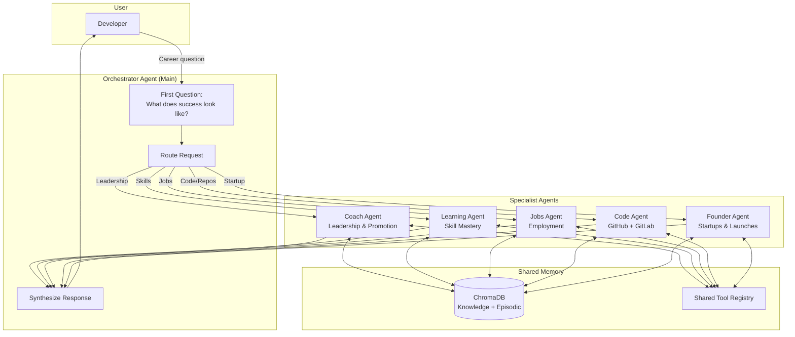

---

## 2. Success Paths Flow

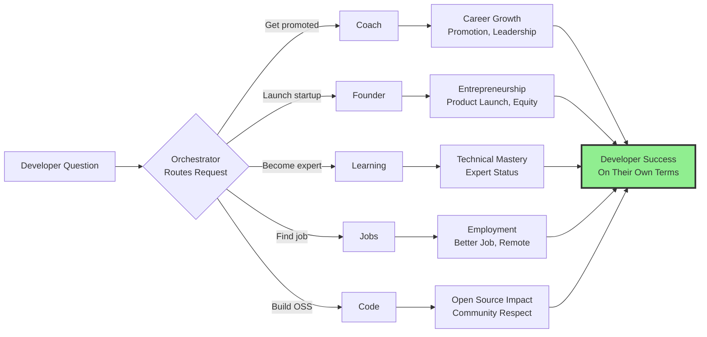

---

## 3. Request Flow (Detailed)

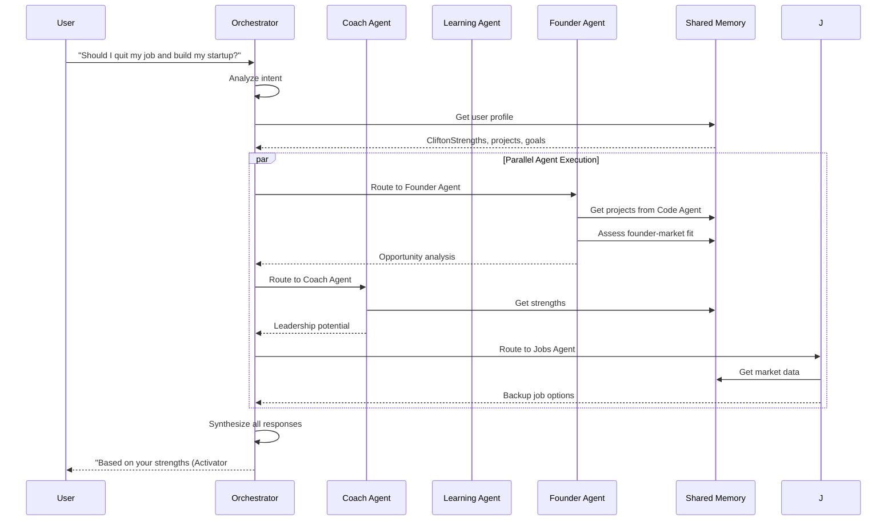

---

## 4. Agent Collaboration Example

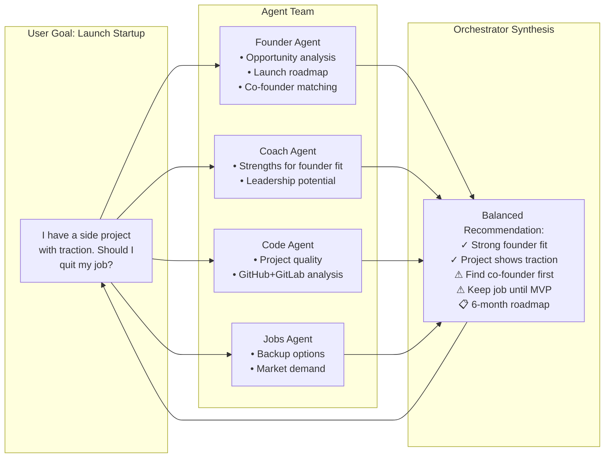

---

## 5. Single-Agent vs. Multi-Agent Comparison

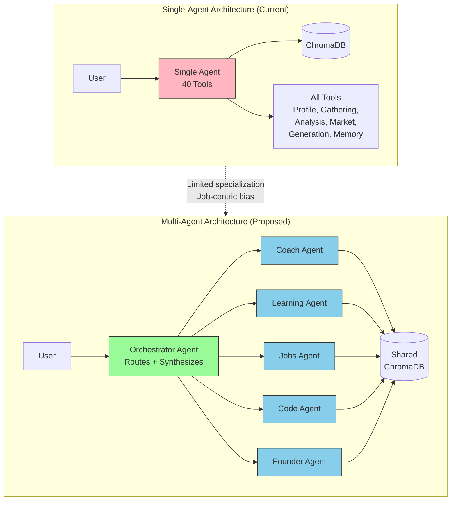

---

## 6. Data Flow: Shared Memory Pattern

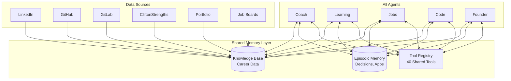

---

## 7. Intent-Based Routing

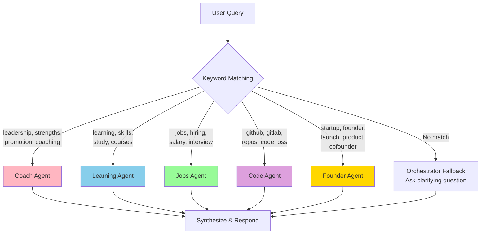

---

## 8. Phase-Based Implementation

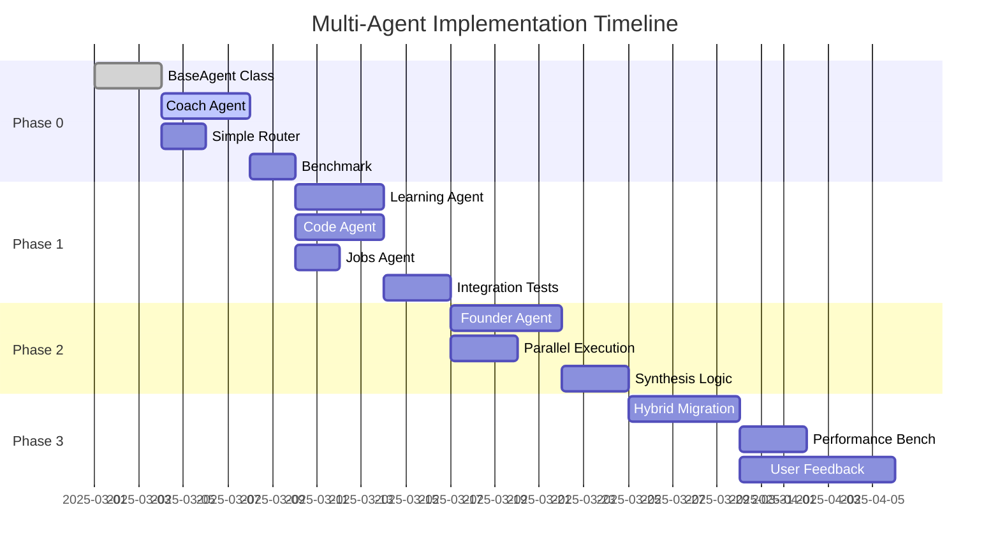

---

## 9. Success Metrics Dashboard

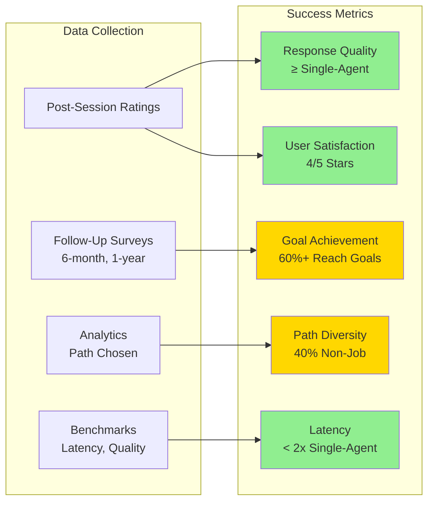

---

## 10. Agent Decision Tree

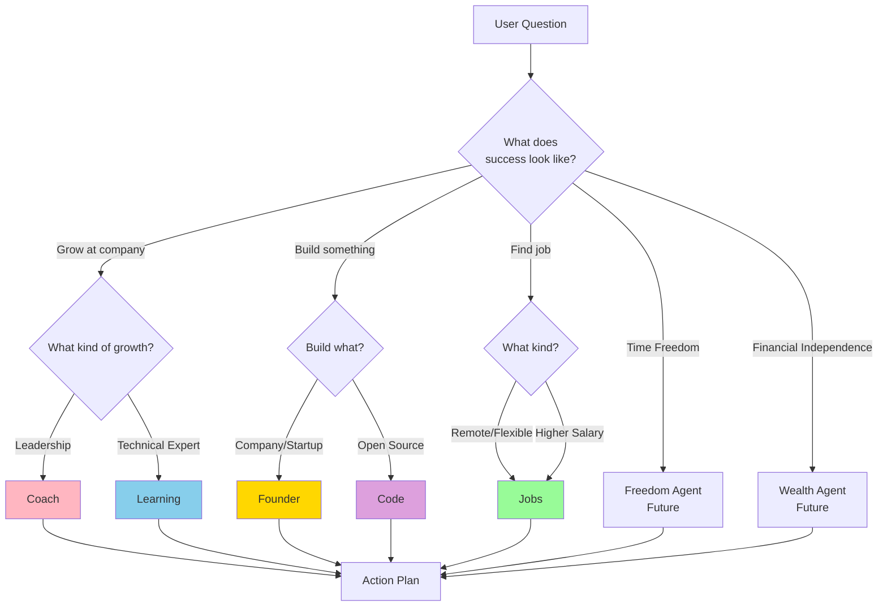

---

## 11. Multi-Agent Communication Pattern

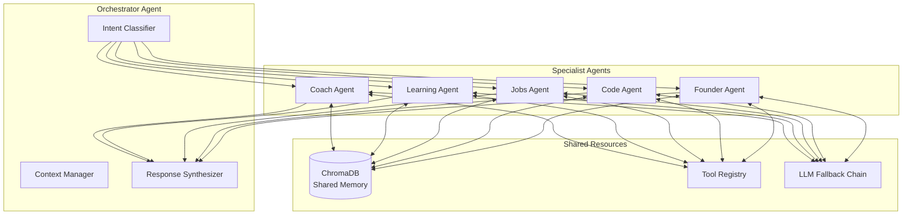

---

## See Also

- [Multi-Agent Design](multi-agent-design.md) — Technical specification
- [Vision Statement](vision-developer-success.md) — Why we're doing this
- [Founder Agent](founder-agent.md) — Entrepreneurial focus
